# @chaos-design/infinity

> A polished, customizable New Tab experience for Chrome. Built for fast search, focused navigation, and lightweight tab organization.

[](https://developer.chrome.com/docs/extensions)
[](https://developer.chrome.com/docs/extensions/develop/migrate/what-is-mv3)
[](https://wxt.dev)
[](https://react.dev)
[](https://www.typescriptlang.org)

Infinity 是一个面向 Chrome / Chromium 浏览器的新标签页扩展，用更高效、更美观的工作台替换默认 New Tab 页面。它将搜索、快捷入口、时钟、背景外观、打开标签页管理和域名标签体系集中在一个轻量界面中，适合日常浏览、资料整理和多标签工作流。

## 预览

| 首页 | Open Tabs 域名视图 | Open Tabs 标签视图 |
| --- | --- | --- |
| 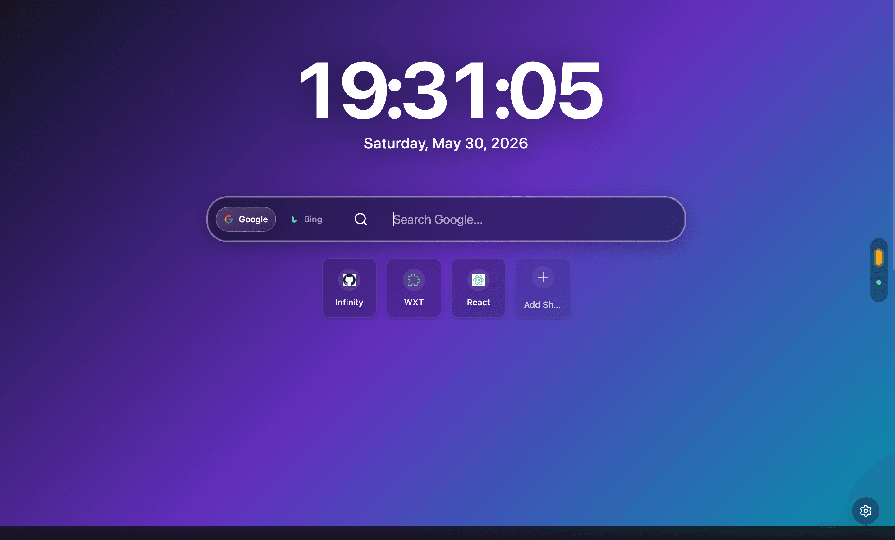 | 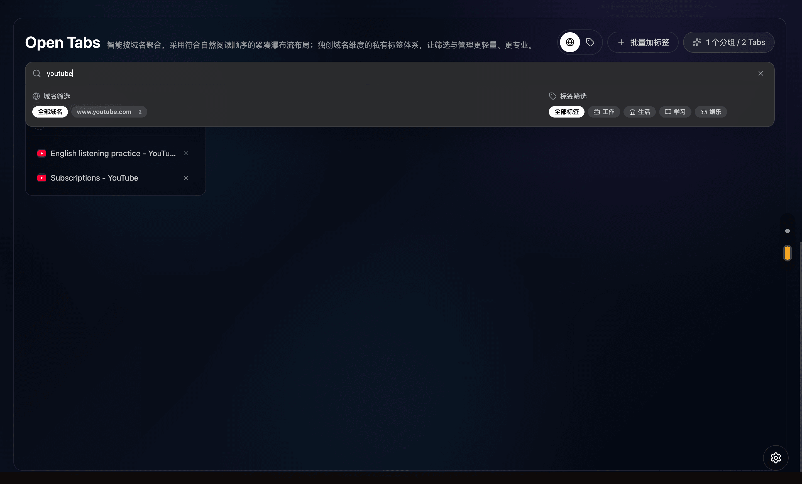 | 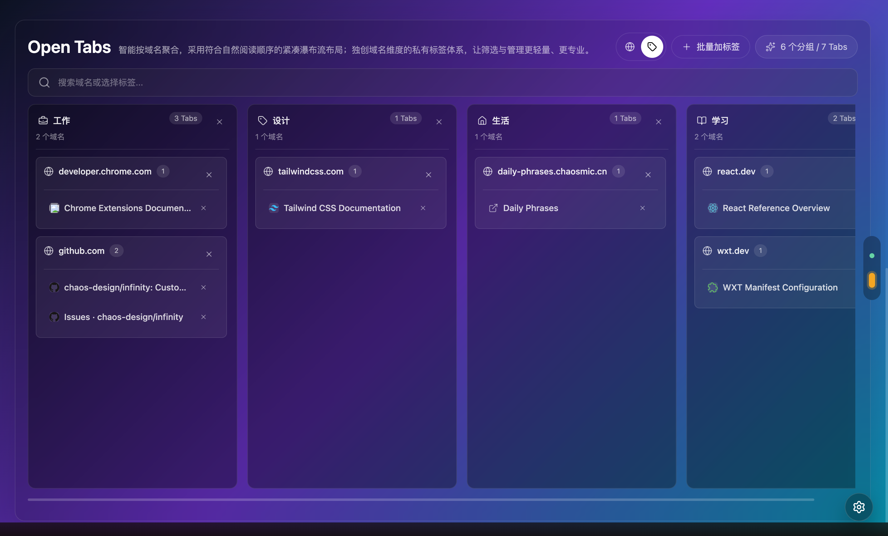 |

| 单个添加标签 | 批量加标签 |
| --- | --- |
| 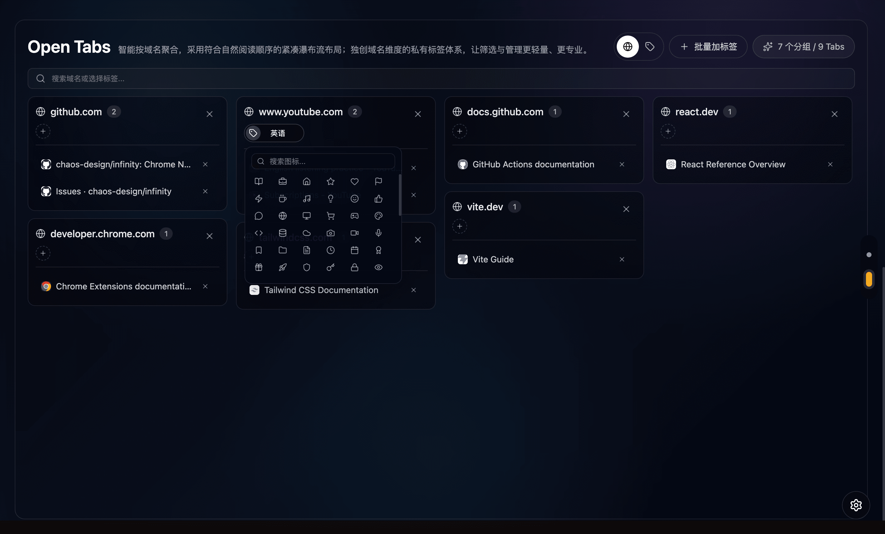 | 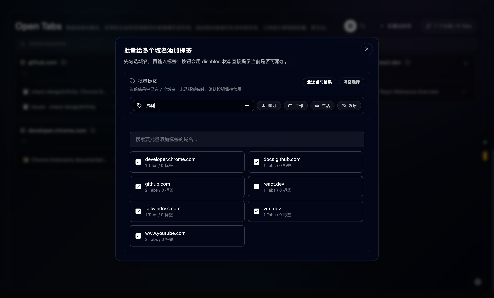 |

| 设置 General | 设置 Appearance | 设置 About |
| --- | --- | --- |
| 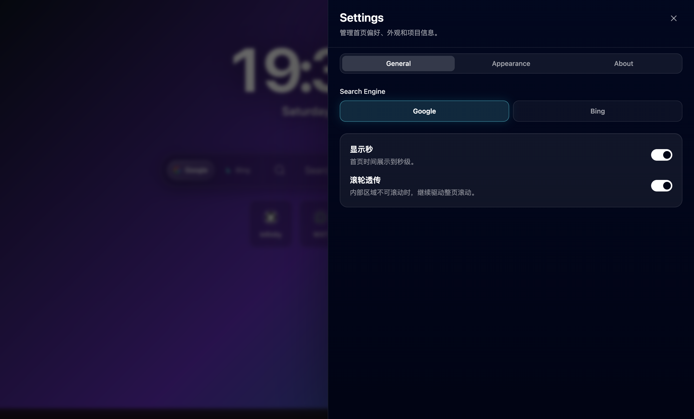 | 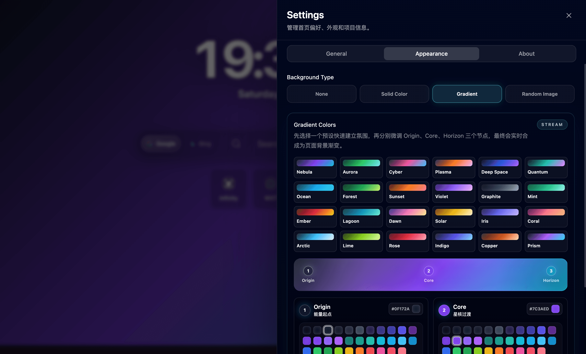 | 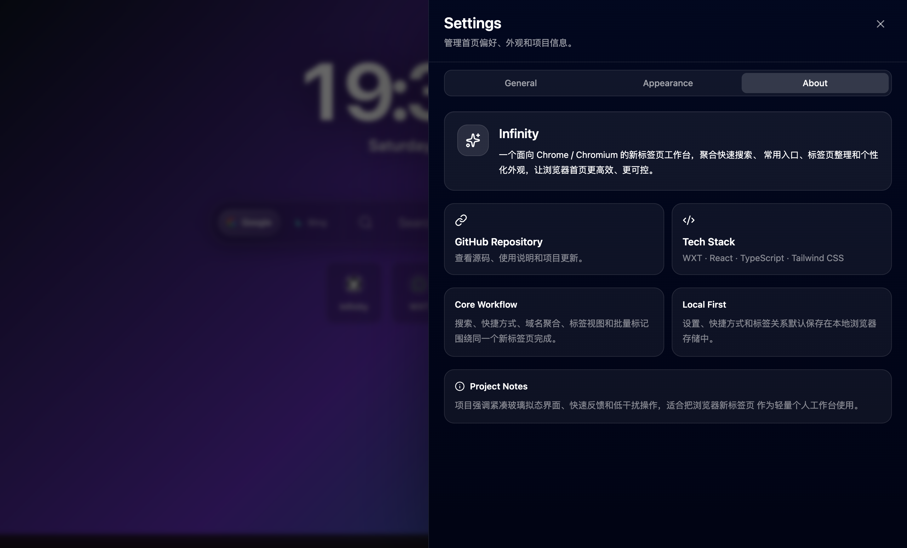 |

| Solid Color 模式 | Solid Color 取色器 | Gradient 模式 | Gradient 取色器 |
| --- | --- | --- | --- |
| 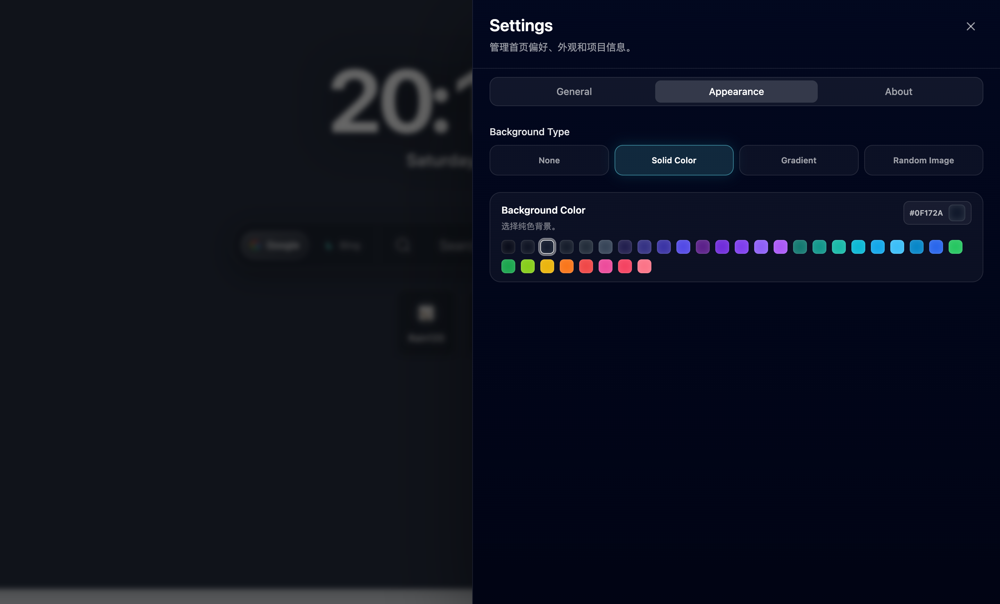 | 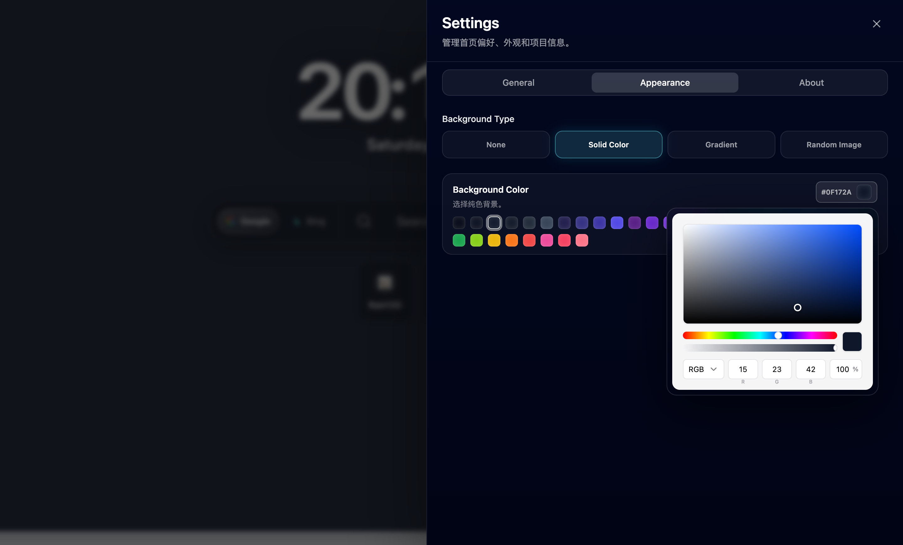 | 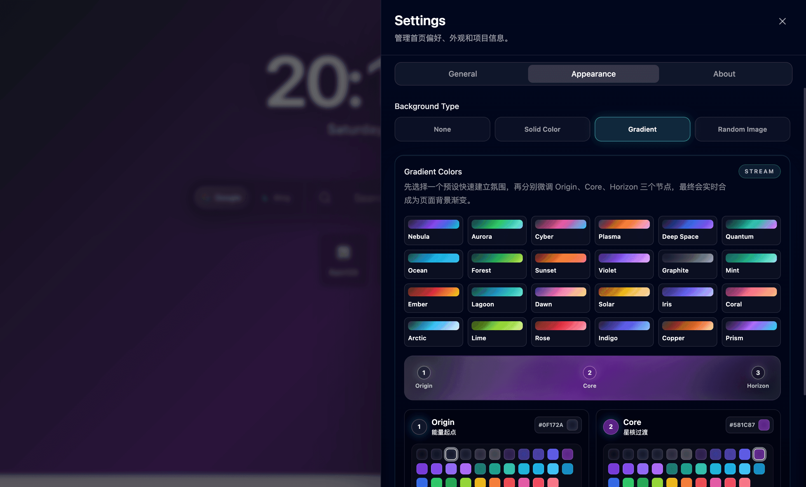 | 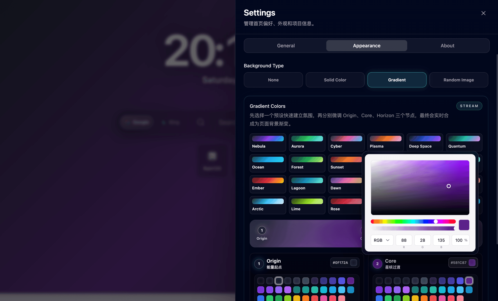 |

## 核心能力

- **高效搜索入口**: 提供集中式搜索框，支持 Google / Bing 一键切换，适合新标签页快速检索。
- **常用站点快捷方式**: 支持新增、编辑、删除网站入口，并自动展示站点 favicon。
- **沉浸式视觉系统**: 支持系统主题、浅色、深色、纯色背景、渐变背景和随机图片背景。
- **打开标签页管理**: 自动读取当前浏览器标签页，按域名聚合展示，支持快速切换、关闭单个标签页和关闭整组标签页。
- **域名标签体系**: 可为域名添加标签和图标，并在域名视图与标签视图之间切换。
- **批量整理能力**: 支持批量选择域名并统一添加标签，降低多标签场景下的整理成本。
- **本地持久化**: 设置、快捷方式和标签关系保存在 `chrome.storage.local`，开发调试时可回退到 `localStorage`。

## 使用场景

- **日常启动页**: 将搜索、时间和常用网站集中到一个干净的新标签页中。
- **资料收集**: 打开大量页面时，按域名或标签快速定位目标资料。
- **工作流整理**: 为工作、学习、生活、娱乐等域名建立标签，减少标签页失控。
- **浏览器个性化**: 通过主题、背景类型和颜色配置打造统一视觉风格。

## 使用手册

本章节面向浏览器扩展的日常使用者，说明 Infinity 安装启用后的主要操作路径与功能使用方式。

### 打开设置面板

1. 点击页面右下角的设置按钮打开右侧设置抽屉。
2. 设置面板分为 **General**、**Appearance** 和 **About** 三个页签。
3. 任意配置项修改后会立即保存，并通过页面右下角 toast 给出反馈。
4. 设置、快捷方式、标签关系会优先保存在 `chrome.storage.local`。

### 搜索与快捷入口

1. 在首页搜索框输入关键词并按 `Enter`，Infinity 会使用当前搜索引擎打开搜索结果。
2. 点击搜索框左侧的 Google / Bing 按钮，可临时切换本次搜索使用的搜索引擎。
3. 在 **Settings > General > Search Engine** 中设置默认搜索引擎。
4. 点击 **Add Shortcut** 新增常用网站，填写标题和 URL 后保存。
5. 快捷方式会自动尝试读取站点 favicon，便于快速识别入口。
6. 悬停快捷方式卡片，可使用图标按钮编辑或删除已有入口。

### General 设置

1. **Search Engine**: 选择 Google 或 Bing，决定首页搜索框默认跳转的搜索服务。
2. **显示秒**: 开启后首页时钟展示到秒级，关闭后只展示小时和分钟。
3. **滚轮透传**: 开启后，内部列表滚动到边界时会继续驱动整页滚动，适合快捷方式或标签页较多的场景。

### 外观设置

1. 打开 **Settings > Appearance**。
2. 在 **Background Type** 中选择背景模式: **None**、**Solid Color**、**Gradient** 或 **Random Image**。
3. 选择 **None** 时页面保留简洁暗色基础背景，适合低干扰使用。
4. 选择 **Random Image** 时会使用在线随机图片背景，网络不可用时可能无法正常加载。

### Solid Color 背景

1. 在 **Appearance > Background Type** 中选择 **Solid Color**。
2. 在 **Background Color** 区域点击预设色块，可快速应用常用深色、蓝紫、青绿、橙红等色彩。
3. 点击右侧 HEX 色值按钮可打开完整取色器，支持色相、透明度和 RGB 通道调整。
4. 修改颜色后会实时更新背景色，并保存到本地设置。

### Gradient 背景

1. 在 **Appearance > Background Type** 中选择 **Gradient**。
2. 在 **Gradient Colors** 区域点击预设卡片，可快速应用 Nebula、Aurora、Cyber、Plasma 等渐变方案。
3. 渐变由三个节点组成: **Origin** 表示起点、**Core** 表示中间过渡、**Horizon** 表示远端光晕。
4. 每个节点都可以通过预设色块快速调整，也可以点击节点右侧 HEX 色值按钮打开取色器精细调整。
5. 任意节点变化后，页面会实时合成为 `linear-gradient(135deg, Origin, Core, Horizon)` 并立即应用。

### 标签页管理

1. 向下滚动或点击右侧锚点进入 **Open Tabs** 页面。
2. 默认以域名为单位聚合同站点标签页，并按分组内标签页数量进行排序。
3. 使用 Open Tabs 顶部搜索框，可按域名、页面标题或标签名称筛选当前打开的页面。
4. 点击标签页条目可切换到对应页面。
5. 点击单个标签页右侧关闭按钮，可关闭该页面。
6. 点击域名分组上的关闭按钮，会关闭该域名下的全部标签页，请确认后再操作。
7. 切换到 **标签视图** 后，系统会按域名标签组织分组，未设置标签的域名会统一归入 **未分类**。

### 域名标签

1. 在标签页管理区域点击域名卡片上的标签入口。
2. 输入标签名称并选择图标，为同一个域名建立可复用的分类标记。
3. 一个域名可以添加多个标签，用于同时归入工作、学习、工具等不同分类。
4. 可切换 **域名视图** 与 **标签视图** 查看不同组织方式。
5. 未设置标签的域名会归入 **未分类**，并保持在标签视图末尾，方便后续补充整理。

### 批量整理

1. 点击 **批量加标签** 打开批量操作面板。
2. 使用搜索框按域名筛选目标站点。
3. 勾选需要处理的域名，可一次选择多个分组。
4. 输入或选择目标标签，并按需选择标签图标。
5. 提交后，选中的域名会统一添加该标签。
6. 批量整理适合在资料收集、调研或多项目并行时快速建立标签体系。

## 开发手册

本章节面向开发者和贡献者，说明如何获取源码、安装依赖、本地调试、构建产物以及加载扩展。

### 环境要求

- Node.js 22.12 或更高版本
- pnpm
- Chrome / Chromium 内核浏览器

### 获取项目

```bash
git clone https://github.com/chaos-design/infinity.git
cd infinity
```

### 安装依赖

```bash
pnpm install
```

### 本地开发

```bash
pnpm dev
```

WXT 会启动开发模式并生成可加载的扩展目录。修改 manifest、权限或扩展级入口后，建议到 `chrome://extensions/` 手动刷新扩展，再重新打开新标签页验证效果。

### 构建扩展

```bash
pnpm build
```

### 加载到 Chrome

1. 打开 `chrome://extensions/`。
2. 开启右上角 **开发者模式**。
3. 点击 **加载已解压的扩展程序**。
4. 选择项目生成的 `.output/chrome-mv3` 目录。
5. 新建标签页，开始使用 Infinity。

### 打包扩展

```bash
pnpm zip
```

- Chrome 构建产物: `.output/chrome-mv3`
- Chrome 分发压缩包: `.output/*.zip`

### Firefox 构建

```bash
pnpm build:firefox
pnpm zip:firefox
```

## 命令清单

| 命令 | 说明 |
| --- | --- |
| `pnpm dev` | 启动 WXT 开发模式 |
| `pnpm build` | 构建 Chrome 扩展 |
| `pnpm zip` | 打包 Chrome 扩展 |
| `pnpm build:firefox` | 构建 Firefox 扩展 |
| `pnpm zip:firefox` | 打包 Firefox 扩展 |
| `pnpm compile` | 执行 TypeScript 类型检查 |
| `pnpm lint` | 执行 Biome 静态检查 |
| `pnpm format` | 使用 Biome 格式化代码 |

## 项目结构

```text
.
├── .github/                # Issue 模板、PR 模板、Release 与维护配置
├── assets/                 # 全局样式与资源
├── components/             # UI 组件与业务组件
├── docs/                   # 发布流程与设计文档
├── entrypoints/newtab/     # 新标签页入口
├── hooks/                  # 设置、标签页、标签数据 hooks
├── lib/                    # 工具函数与标签存储逻辑
├── public/                 # 扩展静态资源
├── screenshots/            # README 截图资源
├── wxt.config.ts           # WXT 与 manifest 配置
└── package.json            # 脚本与依赖配置
```

## 技术栈

| 分类 | 技术 |
| --- | --- |
| 扩展框架 | WXT、Chrome Extension Manifest V3 |
| 前端框架 | React、TypeScript、Vite 8 |
| 样式系统 | Tailwind CSS、Styled Components |
| UI 基础 | Radix UI、shadcn/ui 风格组件 |
| 图标与反馈 | Lucide React、Sonner |
| 工程质量 | Biome、TypeScript |

## 发布与路线图

- [CHANGELOG](./CHANGELOG.md): 记录版本变化、用户可见能力和维护性更新。
- [ROADMAP](./ROADMAP.md): 记录近期发布准备、产品想法、工程方向和暂不支持范围。
- [Release Guide](./docs/release.md): 说明版本号、发布检查项、GitHub Release、Chrome Web Store 和回滚流程。
- Release workflow 会校验 Git tag 与 `package.json` 版本一致，并上传 WXT zip 资源。
- 扩展 manifest 版本由 `package.json` 注入，避免多处手动改版本造成发布不一致。

## 社区与贡献

- 提交 Bug、功能建议或文档问题前，请优先使用 GitHub Issue 中的对应模板。
- 参与开发前请阅读 [贡献指南](./CONTRIBUTING.md)，了解本地开发、分支命名、提交前检查和 PR 流程。
- 提交 Pull Request 时，请按 PR 模板补充变更说明、验证结果、影响范围和关联 Issue。
- 参与讨论和 Review 时，请遵守 [行为准则](./CODE_OF_CONDUCT.md)。
- 如发现安全漏洞，请按照 [安全策略](./SECURITY.md) 私密报告，不要创建公开 Issue。

## 权限与隐私

- `storage`: 保存用户设置、快捷方式、标签关系和视图状态。
- `tabs`: 读取、切换和关闭浏览器标签页，用于标签页管理功能。
- 本项目默认仅使用本地浏览器存储，不主动向远端服务上传用户数据。
- 随机图片背景依赖在线图片地址，网络不可用时可能无法正常显示。
- 完整数据处理说明见 [隐私政策](./PRIVACY.md)。

## FAQ

### 修改代码后新标签页没有变化怎么办？

如果修改了 manifest、权限、入口配置或扩展级逻辑，需要在 `chrome://extensions/` 中刷新扩展，然后重新打开新标签页。

### 数据保存在哪里？

扩展运行时保存在 `chrome.storage.local`。非扩展环境调试时，部分设置会回退保存到浏览器 `localStorage`。

### 是否支持非 Chrome 浏览器？

项目提供 Firefox 构建命令，但主要体验以 Chrome / Chromium 内核浏览器为优先目标。

## License

本项目基于 [Apache License 2.0](./LICENSE) 开源。
